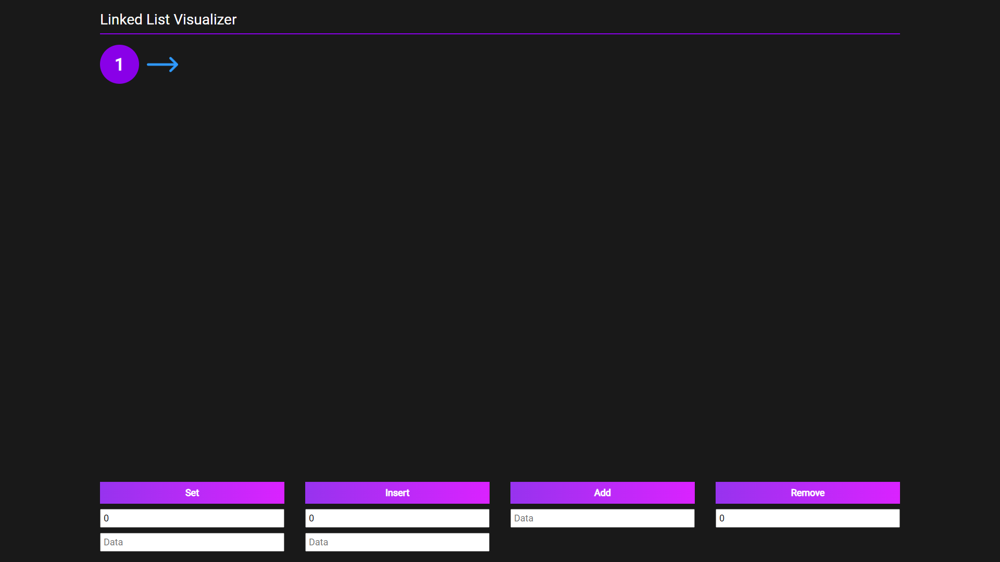
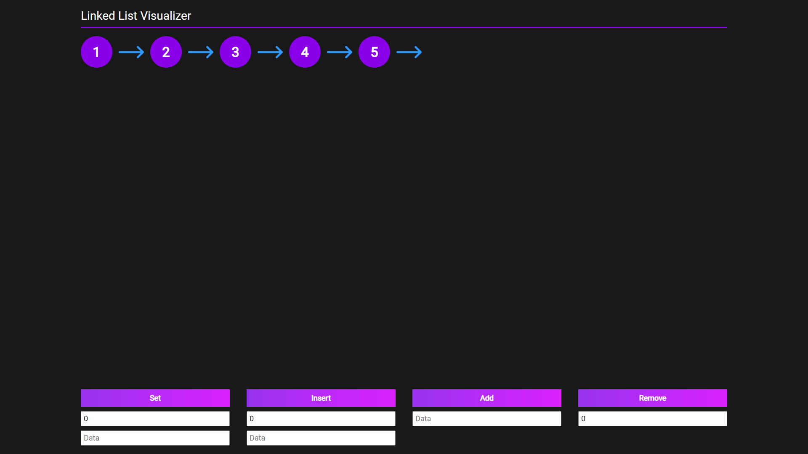

# Linked List Visualizer
Linked List is a data structure that consists of a sequence of nodes, where each node is connected to the next node in the sequence by a pointer. Application allows manage nodes in the list - add, remove, insert and set nodes. 
# Live preview
You can checkout this app here: 
# Tech stack
- Typescript
- React
- React Context API
- CSS Modules
# What I've learned ?
In this project I learned about linked list data structure. Also I learned about CSS Modules and how to use them in React components.
# Screenshots

